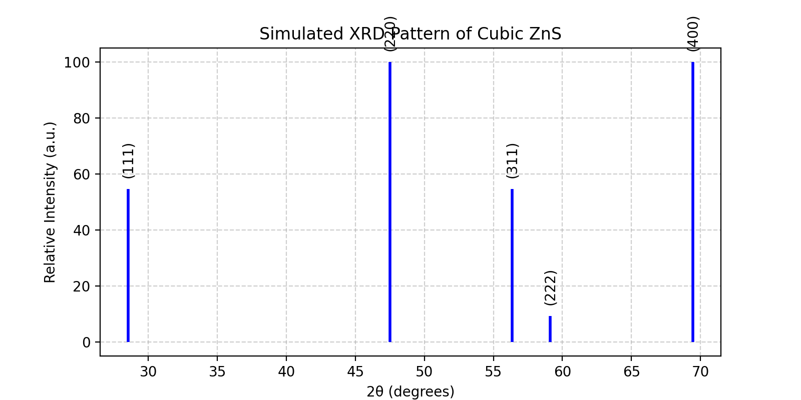

## XRD Simulator

## Simulated X-ray Diffraction (XRD) Pattern of Cubic ZnS using Python

## Overview
This project implements a Python-based simulator for generating X-ray diffraction (XRD) patterns of cubic ZnS (zinc blende).
It demonstrates how Bragg’s law and the structure factor can be used to calculate peak positions (2θ) and relative intensities of diffraction peaks.
The project bridges theoretical modeling with experimental validation using experimental XRD data of ZnS and Ce-doped ZnS.

## Features
- Calculates 2θ positions using Bragg’s law.
- Implements structure factor for Zn and S atoms in the zinc blende lattice.
- Computes relative intensities (normalized to 100).
- Plots a stick diagram of diffraction peaks.
- Compares simulated peaks with experimental XRD data.
- Implemented in Python (NumPy, Matplotlib)

## Output Example  
  
 
## How to Run
1. Clone the repository:  
   git clone https://github.com/Sahilbatool/XRD-simulator-zns.git  
   cd xrd-simulator-zns

2. Install dependencies:  
   pip install numpy matplotlib

3. Run the script:  
   python xrd_simulator.py

## Future Work  
- Extend simulator to other crystal systems using CIF files.  
- Include atomic form factors as a funtion of scattering angle.  
- Overlay experimental vs simulated XRD patterns.

   

   

